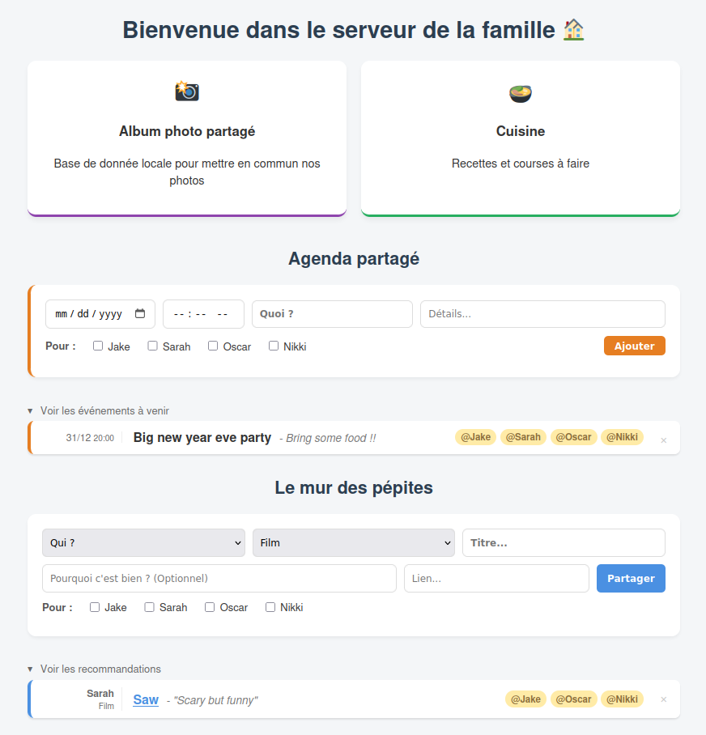

# Flat share / family home server dashboard

A lightweight, self-hosted dashboard designed to run on Radxa, Orange or Raspberry Pi (I ran it on a Radxa Rock 4D. This project centralizes people's activities, photos, and meal planning in a modern, responsive interface.

It acts as a central hub connecting self-hosted services (like [Immich](https://immich.app/) and [Mealie](https://mealie.io/)) with custom-built features like a shared agenda and a recommendation wall ("Le Mur des Pépites").

## Features

### Central dashboard
* **Unified interface:** a clean entry point to all your home services.
* **Responsive design:** works seamlessly on desktop, tablets, and mobile phones.
* **Dynamic links:** quick access to your self-hosted apps.

### Shared agenda
* **Event tracking:** add family events with date, time, and description.
* **User tagging:** tag specific family members (e.g., @daddy, @Anna) involved in the event.
* **Compact view:** events are displayed in a clean, horizontal list to save screen space.
* **Collapsible section:** keep your dashboard airy by hiding the list when not needed.

### "Le mur des pépites" (the *wall of gems*)
* **Recommendation system:** share movies, books, exhibitions, or articles with the family.
* **Rich details:** add links, descriptions, and categories (film, series, exhibition...).
* **Expiration:** automatic cleanup of old recommendations (> 90 days) to keep the list fresh.

## Integrations
* **Immich:** direct integration for the shared photo album.
* **Mealie:** direct link to the meal planner and shopping lists.

## Screenshots

### Main dashboard


## Tech stack

* **Hardware:** optimized for Radxa Rock 4D (ARM64 / rk3576), compatible with Raspberry Pi.
* **Backend:** python (Flask).
* **Frontend:** HTML5, CSS3 (Custom responsive design), Jinja2 templates.
* **Containerization:** Docker & Docker Compose.
* **Data:** JSON-based flat-file storage (No complex SQL database setup required).

## Installation

### Prerequisites
* Docker & Docker Compose installed on your board.
* Git.

### Getting started

1.  **Clone the repository:**
    ```bash
    git clone [https://github.com/AlGoRythm3000/multi-features-home-server.git](https://github.com/AlGoRythm3000/multi-features-home-server.git)
    cd multi-features-home-server
    ```

2.  **Configuration:**
    * Edit `family_app/users.json` to add your family members' names.
    * (Optional) Update ports in `docker-compose.yml` if needed.

3.  **Build and run:**
    ```bash
    docker compose up -d --build
    ```

4.  **Access:**
    Open your browser and go to `http://YOUR_PI_IP` or `http://rock-4d-spi.local`.

---
*Version v1.0.0*
